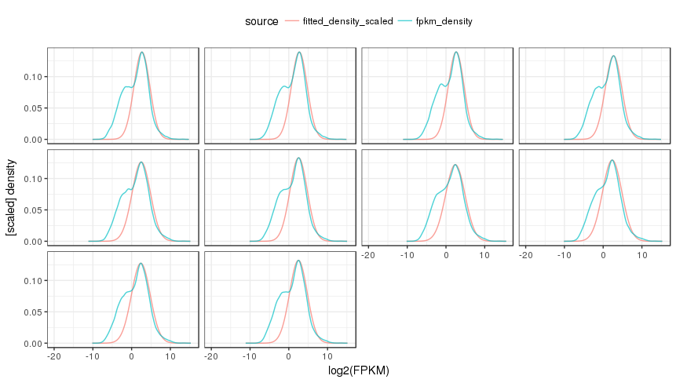

# zFPKM Transformation

## Summary

Perform the zFPKM transform on RNA-seq FPKM data. This algorithm is based on the publication by [Hart et al., 2013 
(Pubmed ID 24215113)](https://www.ncbi.nlm.nih.gov/pubmed/24215113). The reference recommends using zFPKM > -3 to select 
expressed genes. Validated with ENCODE open/closed promoter chromatin structure epigenetic data on six of the ENCODE 
cell lines. It works well for gene level data using FPKM or TPM, but does not appear to calibrate well for transcript level 
data.

## Example

We calculate zFPKM for existing normalized FPKM from [GSE94802](https://www.ncbi.nlm.nih.gov/geo/query/acc.cgi?acc=GSE94802).

```r
library(dplyr)
gse94802 <- "ftp://ftp.ncbi.nlm.nih.gov/geo/series/GSE94nnn/GSE94802/suppl/GSE94802_Minkina_etal_normalized_FPKM.csv.gz"
temp <- tempfile()
download.file(gse94802, temp)
fpkm <- read.csv(gzfile(temp), row.names=1)
fpkm <- select(fpkm, -MGI_Symbol)

library(zFPKM)
zfpkm <- zFPKMTransformDF(fpkm)
```

The `zFPKMTransformDF` function also optionally  plots the Guassian fit to the FPKM data for which the z-scores are based.



To determine which genes are *active* across *all* samples, we use `rowMeans()` and a zFPKM cutoff of -3, as suggested
by the authors.

```r
activeGenes <- which(rowMeans(zfpkm) > -3)
```

---

### References

Hart T, Komori HK, LaMere S, Podshivalova K, Salomon DR. Finding the active genes in deep RNA-seq gene expression 
studies. BMC Genomics. 2013 Nov 11;14:778. doi: 10.1186/1471-2164-14-778.
